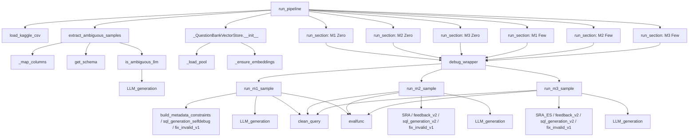

# NL2SQL Pipeline 函数调用流程与数据示例

## 函数调用流程图




## 调用顺序拆解

- `run_pipeline` `engineering/pipeline.py:261-294`
  - 加载数据：`load_kaggle_csv` `engineering/pipeline.py:68-75`
  - 目标样本数：读取 `AMBIGUITY_TARGET_COUNT`
  - 样本筛选：`extract_ambiguous_samples` `engineering/pipeline.py:207-248`
  - 构建向量库：`_QuestionBankVectorStore.__init__` `engineering/pipeline.py:84-90`
    - 载入题库：`_load_pool` `engineering/pipeline.py:91-110`
    - 生成嵌入：`_ensure_embeddings` `engineering/pipeline.py:111-145`
  - 顺序运行 6 个版块：`run_section` `engineering/pipeline.py:250-259`
    - M1 Zero（基线、允许 1 轮自调试）：`run_m1_sample` `engineering/experiments/baseline.py:18-95`
    - M2 Zero（SRA 交互）：`run_m2_sample` `engineering/experiments/sphinteract.py:18-124`
    - M3 Zero（SRA+ES 交互+早停）：`run_m3_sample` `engineering/experiments/break_no_ambiguity.py:18-124`
    - M1/M2/M3 Few：同上，但 `n_shots_few` 为 3
  - 统计输出：各方法行数与准确率；以及每方法 `total/init_ok/fix_ok/sra_ok/avg_rounds` 与 `Overall` 汇总

- `extract_ambiguous_samples` `engineering/pipeline.py:207-248`
  - 列识别：`_map_columns` `engineering/pipeline.py:188-205`
  - 严格校验：必须包含 `nl`（自然语言问题）、`sql`（Gold SQL）、`db_id`
  - 获取库结构：`get_schema` `engineering/db/locator.py:6-13`（内部用 `generate_db_schema` `engineering/db/schema.py:3-16`）
  - 模糊判定：`is_ambiguous_llm` `engineering/pipeline.py:29-66`
    - LLM 调用：`LLM_generation` `engineering/llm/client.py:44-121`
    - 解析回答：支持 `Answer: **Yes**`/`Answer: **No**` 及兼容格式
  - 早停：命中 `k` 条（默认 10）即停止遍历

- `run_section` `engineering/pipeline.py:250-259`
  - 包裹打印：`debug_wrapper` `engineering/debug/demo.py:8-36`
  - 迭代样本：逐条调用方法函数并收集字典结果

- M1 基线：`run_m1_sample` `engineering/experiments/baseline.py:18-95`
  - 初始提示：DAIL-SQL 风格 + 元数据约束 `build_metadata_constraints` `engineering/llm/prompts.py:87-100`
  - 生成 SQL：`LLM_generation` `engineering/llm/client.py:44-121` → `clean_query` `engineering/utils/sanitize.py:3-28`
  - 评估与修无效：`evalfunc` `engineering/db/exec.py:15-43`；若不可执行，`fix_invalid_v1` `engineering/llm/prompts.py:66-75` 进行一次纠错
  - 自调试轮：`sql_generation_selfdebug` `engineering/llm/prompts.py:77-85`，最多 1 轮（Zero）

- M2 交互：`run_m2_sample` `engineering/experiments/sphinteract.py:18-124`
  - 初始生成失败后进入交互轮（最多 4 轮）
  - 生成澄清问题：`SRA` `engineering/llm/prompts.py:1-25` → `LLM_generation`
  - Oracle 反馈：`feedback_v2` `engineering/llm/prompts.py:126-142` → `LLM_generation`
  - 带反馈再生成：`sql_generation_v2` `engineering/llm/prompts.py:54-64` → `LLM_generation`
  - 清洗与评估：`clean_query` → `evalfunc`，必要时 `fix_invalid_v1`

- M3 交互（含早停）：`run_m3_sample` `engineering/experiments/break_no_ambiguity.py:18-124`
  - 初始生成失败后进入交互轮（最多 4 轮）
  - 生成澄清问题：`SRA_ES` `engineering/llm/prompts.py:27-52`（若模型输出 `NO AMBIGUITY` 直接早停）
  - Oracle 反馈与再生成：同 M2

- 其他关键函数
  - `evalfunc` `engineering/db/exec.py:15-43`：独立进程执行候选 SQL，与 Gold SQL 结果对比（排序无关）
  - `clean_query` `engineering/utils/sanitize.py:3-28`：去除 Markdown 包裹与无关字符，定位到 `SELECT`/`WITH`
  - `debug_wrapper` `engineering/debug/demo.py:8-36`：打印输入签名与输出，便于日志核验

## 数据案例演示（贯穿全流程）

以样本 NL 问题为例：`"Name the most popular release on houston."`，对应数据库 `db_id="WhatCDHipHop"`。

- 1) 加载数据
  - `load_kaggle_csv` 读取 CSV，并打印行列信息（`engineering/pipeline.py:68-75`）
  - 日志示例：`[TRACE] load_kaggle_csv path=... rows=333 cols=14`

- 2) 样本筛选
  - `extract_ambiguous_samples` 迭代行，识别列（`engineering/pipeline.py:188-205`）
  - `get_schema` 获取 SQLite 的表结构（`engineering/db/locator.py:6-13`）
  - `is_ambiguous_llm` 发送判定提示（`engineering/pipeline.py:29-47`），`LLM_generation` 返回回答（`engineering/llm/client.py:71-77`）
  - 解析 `Answer: **Yes**` 命中后加入样本集；当累计到 10 条时早停（`engineering/pipeline.py:242`）
  - 日志示例：`[TRACE] is_ambiguous_llm result=YES resp=Answer: **Yes**` → `accepted ... total=1`

- 3) 构建向量库
  - `_QuestionBankVectorStore._load_pool` 扫描题库 JSON（`engineering/pipeline.py:91-110`），构建 `(nl, gold)` 池
  - `_ensure_embeddings` 在 `VECTOR_EMBED_MODE=embed` 时批量生成嵌入（`engineering/pipeline.py:111-145`）
  - 日志示例：`created_embeddings shape=(256, 1536)`

- 4) M1 Zero（允许 1 轮自调试）
  - `run_section` 包裹 `run_m1_sample`（`engineering/pipeline.py:250-259`），打印输入输出（`engineering/debug/demo.py:11-35`）
  - 初始提示包含约束（`engineering/llm/prompts.py:87-100`），`LLM_generation` 生成 SQL 后 `clean_query` 清洗（`engineering/utils/sanitize.py:3-28`）
  - `evalfunc` 与 Gold SQL 比较；若不可执行，调用一次 `fix_invalid_v1` 修无效（`engineering/llm/prompts.py:66-75`）
  - 案例输出（来自日志）：`SELECT torrents.groupName FROM torrents JOIN tags ON torrents.id = tags.id WHERE tags.tag = 'houston' ORDER BY torrents.totalSnatched DESC LIMIT 1`
  - 字段变化：从 NL 文本 → 提示模板拼接 → LLM 文本 → 清洗为 SQL → 执行比较结果字典 `{id, nlq, final_sql, rounds, is_correct, syntax_fix}`

- 5) M2 Zero（如初次即正确则无需交互）
  - 若 M1/M2 初次即正确，返回 `rounds=0`；否则进入交互轮：
    - 生成澄清问题：`SRA` → `LLM_generation`；系统打印 `[PROMPT M2 cq]` 与 `[CQ]`
    - 反馈回答：`feedback_v2` → `LLM_generation`；系统打印 `[PROMPT M2 feedback]` 与 `[ANSWER]`
    - 带反馈再生成：`sql_generation_v2` → `LLM_generation` → `clean_query` → `evalfunc`；必要时 `fix_invalid_v1`
  - 在该样本上，M2 通常也可直接正确（`rounds=0`）

- 6) M3 Zero（含早停）
  - 流程同 M2，澄清用 `SRA_ES`；若模型输出 `NO AMBIGUITY`，提前终止交互
  - 在该样本上，M3 也通常直接正确（`rounds=0`）

- 7) Few-Shot 版块（M1/M2/M3 Few）
  - `run_pipeline` 通过 `n_shots_few=3` 传入，方法内部在生成前拼接题库示例（M1：`engineering/experiments/baseline.py:63-71`；M2/M3：`engineering/experiments/sphinteract.py:101-104`, `engineering/experiments/break_no_ambiguity.py:101-104`）
  - 其余步骤与 Zero 相同

## 关键输入/输出与状态变化（一览）

- 输入数据行（CSV）：
  - `nl` 自然语言问题，`sql` Gold SQL，`db_id` 数据库标识
- 判定与筛选：
  - LLM 回答 `Yes/No` → 仅保留 `Yes`
  - 计数达到 `k=10` → 提前结束筛选
- 方法执行结果（每条样本）：
  - 结构：`{'id', 'nlq', 'final_sql', 'rounds', 'is_correct', 'syntax_fix'}`
  - 语义：最终 SQL、交互轮次、是否正确、是否触发“修无效”
- 统计输出（新增）：
  - 每方法：`M* *-Shot: total={N} init_ok={A} fix_ok={B} sra_ok={C} avg_rounds={R}`
    - `init_ok`: 初次即正确（`rounds=0` 且 `is_correct=True` 且 `syntax_fix=False`）
    - `fix_ok`: 初次不可执行，经一次 `fix_invalid_v1` 纠正后正确（`rounds=0` 且 `syntax_fix=True`）
    - `sra_ok`: 通过交互轮纠正正确（`rounds>0` 且 `is_correct=True`）
    - `avg_rounds`: 平均交互轮数
  - Overall：六方法合并的整体指标与比例

## 可复现入口与环境

- 入口脚本：`engineering/verify/run_zero.py:5`（`run_pipeline(n_shots_few=3, max_rounds=4)`）
- 模型统一：`OPENAI_MODEL` 与 `AMBIGUITY_MODEL` 均为 `qwen3-32b`（`engineering/.env`）
- 最新运行日志：`engineering/logs/pipeline_run_20251222_193349.log`

## 模型输入形式（M1/M2/M3）

- M1 初始生成（Zero/Few 通用）
  - 形式：前缀 + Schema + 元数据约束 + 问题
  - 示例（变量替换后）：
    ```
    Complete sqlite SQL query only and with no explanation.
    /* Given the following database schema: */
    {schema}
    /* Constraints: SQL must be executable on the given schema and use a single consistent granularity across tables. */
    /* When tables differ in granularity, aggregate to a common key before joining; do not join district/school rows directly to state-level aggregates. */
    /* Use only valid join keys present in the schema with matching types; prefer exact equality joins. */
    /* If feedback conflicts with these constraints, follow the constraints. */
    /* Answer the following with no explanation: {nlq} */
    ```
  - Few-Shot 时：在上述前缀之前拼接 `get_few_shot_examples(...)` 返回的示例块

- M1 自调试（Zero 允许 1 轮；Few 可最多 4 轮）
  - 形式：`sql_generation_selfdebug` 模板 + 可能的 few-shot 前缀
  - 示例：
    ```
    /* Given the following database schema: */
    {schema}
    /* And the following incorrect sql answers: */
    {sqls}
    
    /* Answer the following with no explanation: {question} */
    /* Output ONLY SQL wrapped in a markdown block: ```sql */
    ```

- M1 修无效
  - 形式：`fix_invalid_v1` 模板（携带异常信息）
  - 示例：
    ```
    /* Given the following database schema: */
    {schema}
    /* And the following inexecutable sql query */
    {invalidSQL}
    /* And the following exception message */
    {ex}
    
    /* Fix the exception and write a new executable SQL query with no explanation */
    /* Output ONLY SQL wrapped in a markdown block: ```sql */
    ```

- M2 初始生成
  - 形式与 M1 初始一致，增加 `build_metadata_constraints(...)` 注入的约束

- M2 生成澄清问题（SRA）
  - 形式：`cq_prefix_v1` 示例前缀 + `SRA.format(schema, question, sqls, cqs)`
  - 示例：
    ```
    /* some examples are provided */
    ...（示例前缀省略）
    /* Ask the user a new multiple choice clarification question to help you find the correct SQL answer for the following question: */
    {question}
    /* Given the following database schema: */
    {schema}
    /* And the following incorrect sql answers: */
    {sqls}
    /* And the following previous clarification questions and user replies: */
    {cqs}
    ...（四类歧义说明与分步指引）
    ```
  - 输出：模型应以 `mul_choice_cq = "..."` 的形式给出选择题

- M2 反馈回答（Oracle）
  - 形式：`feedback_prefix_v1` 示例前缀 + `feedback_v2.format(nlq, query, question)`
  - 输出：模型应以 `answer_to_cq = "..."` 的形式给出答案
  - 说明：此处“Oracle”指以 Gold SQL 为真值来源的自动反馈，不依赖真人用户（`engineering/llm/prompts.py:126-142`；调用位置 `engineering/experiments/sphinteract.py:78-88`, `engineering/experiments/break_no_ambiguity.py:79-89`）

- M2 带反馈再生成
  - 形式：`sql_generation_v2.format(schema, sqls, cqas, metadata)`；Few-Shot 拼接 `get_feedback_few_shot_examples(...)` 返回的示例块
  - `cqas` 为如下拼接的文本块：
    ```
    multiple choice clarification question: {cq_1}
    user: {ans_1}
    multiple choice clarification question: {cq_2}
    user: {ans_2}
    ...
    ```

- M3 初始生成
  - 形式与 M1 初始一致，注入 `build_metadata_constraints(...)` 以确保统一粒度与合法连接键（`engineering/experiments/break_no_ambiguity.py:27-33`）

- M3 生成澄清问题（SRA_ES，含早停）
  - 形式：`cq_prefix_v1` + `SRA_ES.format(schema, question, sqls, cqs)`
  - 行为：若模型输出包含 `NO AMBIGUITY`，本轮直接早停

- M3 反馈与再生成
  - 形式与 M2 相同：`feedback_v2` + `sql_generation_v2`，并注入 `build_metadata_constraints(...)`；必要时 `fix_invalid_v1`

## Embedding 触发时机与作用

- 触发时机
  - 在进入各方法版块前，`_QuestionBankVectorStore.__init__` 调用 `_ensure_embeddings`：
    - 若 `VECTOR_EMBED_MODE=embed` 且 `EMBED_DISABLE!=1`，对题库文本执行一次批量嵌入，保存为矩阵（受 `EMBED_MAX_DOCS`, `EMBED_BATCH_SIZE` 控制）
    - 否则禁用嵌入，改用分词重合度的回退算法
  - 当 `n_shots>0` 时，`similarity_search(query, k)` 对目标 NLQ 执行查询嵌入，并与题库嵌入计算相似度选取示例；Zero-Shot（`n_shots=0`）不触发示例检索

- 作用范围
  - 仅用于 Few-Shot 示例检索与拼接，不参与 SQL 生成与执行本身
  - 嵌入模型由 `EMBED_MODEL` 控制（默认 `text-embedding-3-small`），与生成模型独立

## qwen3-32b 适配情况

- 统一模型设置
  - 生成/澄清/反馈均使用 `OPENAI_MODEL`（pipeline 中统一传入），当前 `.env` 为 `qwen3-32b`
  - 模糊判定 `is_ambiguous_llm` 使用 `AMBIGUITY_MODEL`，当前 `.env` 也为 `qwen3-32b`
  - 代码位置：
    - 模糊判定模型：`engineering/pipeline.py:32-33`
    - 方法模型参数传递：`engineering/pipeline.py:270-277`
    - 反馈模型统一：`engineering/experiments/sphinteract.py:82`、`engineering/experiments/break_no_ambiguity.py:83`

- 适配结论
  - 支持“回答/提问模型均为 `qwen3-32b`”的配置；已在运行日志中验证（模型打印为 `qwen3-32b`）
  - 嵌入模型独立于生成模型；若需统一为某个供应商的嵌入，可将 `EMBED_MODEL` 改为相应模型，并确保后端支持

## 数据流与格式变化（kaggle_dataset.csv → pipeline → databases）

- 数据读取
  - 入口：`load_kaggle_csv` `engineering/pipeline.py:68-75`，读取 `/Users/liuzichun/Desktop/Classes/SDSC_5003/Final_Project/kaggle_dataset.csv` 为 `DataFrame`
  - 列映射：`_map_columns` `engineering/pipeline.py:188-205`，识别 `nl`（问题）、`sql`（Gold SQL）、`db_id`（数据库标识）

- 样本筛选与歧义判定
  - 函数：`extract_ambiguous_samples` `engineering/pipeline.py:207-248`
  - 获取库结构：`get_schema` `engineering/db/locator.py:6-13`
  - 歧义判定：`is_ambiguous_llm` `engineering/pipeline.py:29-66`，调用 `LLM_generation` 让模型回答 “Yes/No”，仅保留 `Yes`
  - 格式变化：从原始 CSV 行到筛选后的样本字典，字段为 `{'nl','sql','db_id'}`

- 数据库信息提取与利用
  - 路径解析：`get_db_path`（各方法内调用，见 `engineering/experiments/baseline.py:23-25`, `engineering/experiments/sphinteract.py:23-25`, `engineering/experiments/break_no_ambiguity.py:23-26`），解析至 `/Users/liuzichun/Desktop/Classes/SDSC_5003/Final_Project/databases/<DB>/<DB>.sqlite`
  - 结构文本：`get_schema` 返回可读的 Schema 字符串，用于提示拼接（同上）
  - 执行评估：`evalfunc` `engineering/db/exec.py:15-43`，在独立进程中对 `db_path` 执行候选 SQL，与 Gold SQL 比较（排序无关），返回 `is_correct/errors`

- 方法执行中的格式变化
  - 提示拼接：Schema + 约束 + 问题（首轮）；或 Schema + 错误 SQL/澄清与反馈（再生成）
  - 文本到 SQL：`LLM_generation` 输出文本，`clean_query` `engineering/utils/sanitize.py:3-28` 清洗为 SQL（去除 Markdown 包裹、定位到 `SELECT/WITH`）
  - 结果记录：每条样本方法返回 `{'id','nlq','final_sql','rounds','is_correct','syntax_fix'}`，其中 `rounds` 表示触发重写的轮次数

- Few-Shot 示例检索与使用
  - 向量库：`_QuestionBankVectorStore` `engineering/pipeline.py:84-145` 从题库 JSON 构建池，嵌入检索或分词重合回退
  - 示例构造：`get_few_shot_examples` `engineering/llm/fewshot.py:1-17`，生成“Question + Gold SQL”示例块
  - 使用阶段：
    - 首轮生成（Few-Shot 时）：M1/M2/M3 在首轮前置拼接示例（`engineering/experiments/baseline.py:28-33`, `engineering/experiments/sphinteract.py:28-33`, `engineering/experiments/break_no_ambiguity.py:28-33`）
    - 自调试阶段（仅 M1）：保留固定示例前缀 `make_selfdebug_few_shot` `engineering/llm/prompts.py:264-273`，并复用首轮缓存的示例块 `engineering/experiments/baseline.py:63-68, 68-71`（已改为复用，不再重复检索）
    - 交互后的再生成：M2/M3 不再拼接 few-shot 示例，仅使用上一轮的 `cqas_block` 与约束（`engineering/experiments/sphinteract.py:98-107`, `engineering/experiments/break_no_ambiguity.py:100-108`）

- 轮次统计口径（更新）
  - 指标：`init_ok`（首轮正确、未触发修无效）、`fix_ok`（首轮正确、触发一次修无效）、`sra_ok`（交互/自调试后正确）
  - 平均轮数：`avg_rounds` 仅对触发重写的样本计算（`rounds>0`）；实现位置：`_calc_method_stats` `engineering/pipeline.py:260-271`
